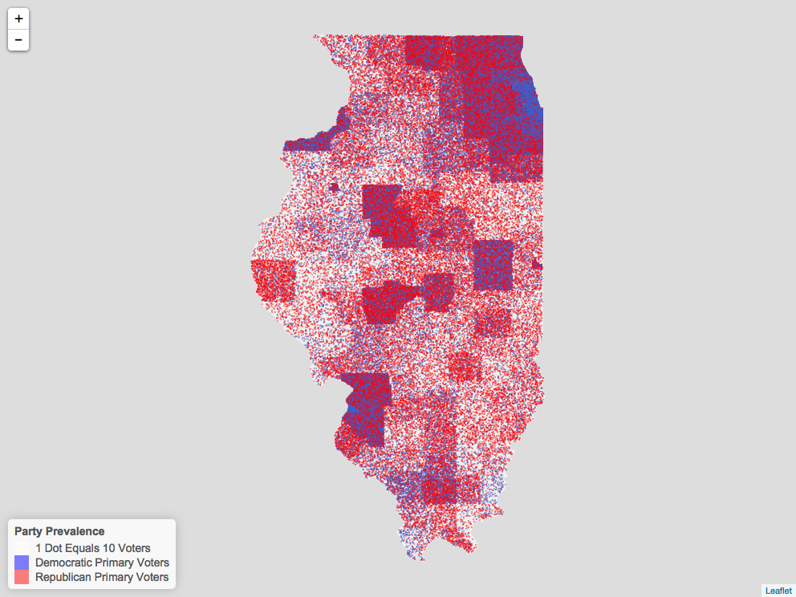

```{r setup, include=FALSE}
knitr::opts_chunk$set(echo = TRUE)
```
## Intro

The following tutorial shows you how to recreate a dot map for 2016 primary election in Illinois.

Prepare a csv file with JurisdictionID, JurisdictionName, gopVotes, demVotes, totalVotes, %gop, and %dem.You'll also need jurisdiction shp files (for Illinois)

We'll use leaflet to draw an interactive map and save it to a static image.

### Load libraries

```{r libraries, warning=FALSE, message=FALSE}
library(dplyr)
library(leaflet)
library(rgdal)
library(htmlwidgets)
library(webshot)
library(raster)
```

### Read shp data

```{r, eval=FALSE}
#read in shp file for illinois jurisdictions
juris <- readOGR("jurisdictions/il_jurisdictions.shp",layer = "il_jurisdictions", GDAL1_integer64_policy = TRUE)
```

### Read vote distribution data

```{r, eval=FALSE}
#read in voter data
distri_df <- read.csv("2016_primary_data.csv")
```

### Build a function to clean, transform and merge datasets

This function will return a sub dataset for a jurisdiction, containing random coordinates within this jurisdiction. One dot represents 10 votes, blue for dem and red for gop.

Input argument is an interger (JurisdictionID).

```{r}
#subset of a jurisdiction
sub_juris <- function(JurisCode){
  #subset the dataset
  juris_subset <- juris[juris@data$JurisCode == JurisCode,]
  totalVote <- distri_df[distri_df["JurisdictionID"] == JurisCode][5] #5th column, totalCount
  totalVote <- as.numeric(totalVote)
  #function to generate random points within a polygon, number of points = totalVote/10
  points <- spsample(as(juris_subset, 'SpatialPolygonsDataFrame'),n=totalVote/10, type="random")
  values <- extract(juris,points)
  df <- cbind.data.frame(coordinates(points),values) 
  vote <- sample(c("rep","dem"), nrow(df), replace=TRUE, prob = c(distri_df[distri_df["JurisdictionID"] == JurisCode][6],distri_df[distri_df["JurisdictionID"] == JurisCode][7])) #randomly label the dots as rep/dem, proportional to vote distribution
  df <- cbind.data.frame(df,vote)
  return(df) #return a data frame with coordinates of all random points, ready for plot
}
```

### Build a loop to call the function and return a dataset with random coordinates in all jurisdictions

```{r, eval=FALSE}
df_total = data.frame()
for (i in 1:110){
# skip jurisdiction 109 cause we don't have 109 in illinois
  if(i==109) next
  df <- sub_juris(i)
  df_total <- rbind(df_total,df)
}
```

### Draw the map

```{r, eval=FALSE}
#define colors: http://www.stat.columbia.edu/~tzheng/files/Rcolor.pdf
pal <- colorFactor(c("royalblue3", "red"), domain = c("dem", "rep"))

#make the map: jurisdiction as background + data points from voters
map <- leaflet(data = juris) %>%
  addPolygons(color = "white", weight = 1, smoothFactor = 0.2,
    opacity = 0.5, fillOpacity = 0.5,
    highlightOptions = highlightOptions(color = "white", weight = 1,
      bringToFront = TRUE)) %>%
    addCircleMarkers(df_total$x, df_total$y,
                      radius = ifelse(df_total$vote == "dem", 1.1, 1.1), #adjust size of dots
                      color = pal(df_total$vote),
                      stroke = FALSE, 
                      fillOpacity = 0.5, #adjust transparency of dots
                      label = df_total$JurName #make a label with locations
               ) %>%
    addLegend("bottomleft", labels = c("1 Dot Equals 10 Voters", "Democratic Primary Voters", "Republican Primary Voters"), colors = c("white", "blue", "red"),
    title = "Party Prevalence",
    #labFormat = labelFormat(prefix = "$"),
    opacity = 0.5
  )

map

## save html to png
#webshot::install_phantomjs() #comment out if you've already installed it
saveWidget(map, "temp.html", selfcontained = FALSE)
webshot("temp.html", file = "Rplot.png",
        cliprect = "viewport")
```

### insert the static map



